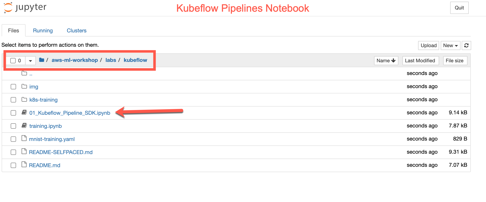

Note: This lab assumes you have Kubeflow installed on an EKS cluster along with a Notebook Server. See the [README](README.md) for details...

## Kubeflow Pipelines

Kubeflow pipelines are reusable end-to-end ML workflows built using the Kubeflow Pipelines SDK.

The Kubeflow pipelines service has the following goals:

- **End to end orchestration**: enabling and simplifying the orchestration of end to end machine learning pipelines
- **Easy experimentation**: making it easy for you to try numerous ideas and techniques, and manage your various trials/experiments
- **Easy re-use**: enabling you to re-use components and pipelines to quickly cobble together end to end solutions, without having to re-build each time

### Run Through a Kubeflow Pipeline Example

- In the Jupyer notebook interface, open the `01_Kubeflow_Pipeline_SDK.ipynb` file under the `aws-ml-workshop/labs/kubeflow` folder. 

- This notebook walks you through an example for building a kubeflow pipeline. Step through the notebook cells to see kubeflow pipeline in action.

## Next: Kubeflow Pipeline using SageMaker Components

In the next lab, we will use the Kubeflow Pipeline components for Amazon SageMaker and train a classification model using Kmeans with MNIST dataset on SageMaker

Next Lab => [Kubeflow Pipelines using SageMaker Components](../sagemaker-kubeflow-pipeline/README.md)
