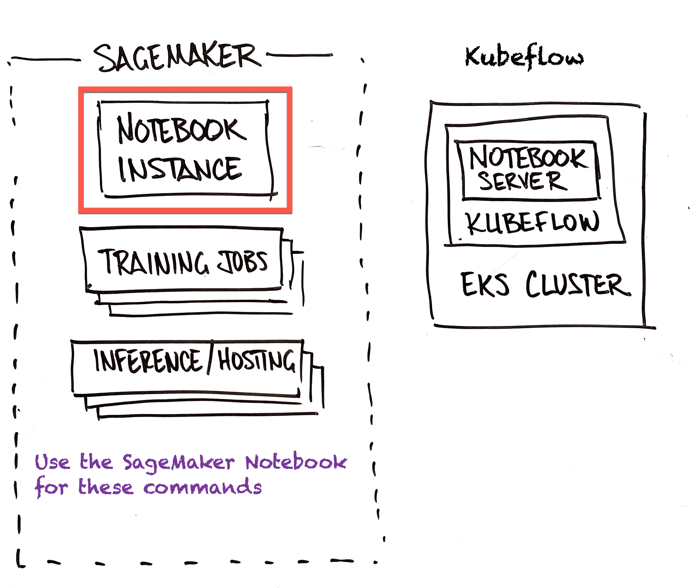
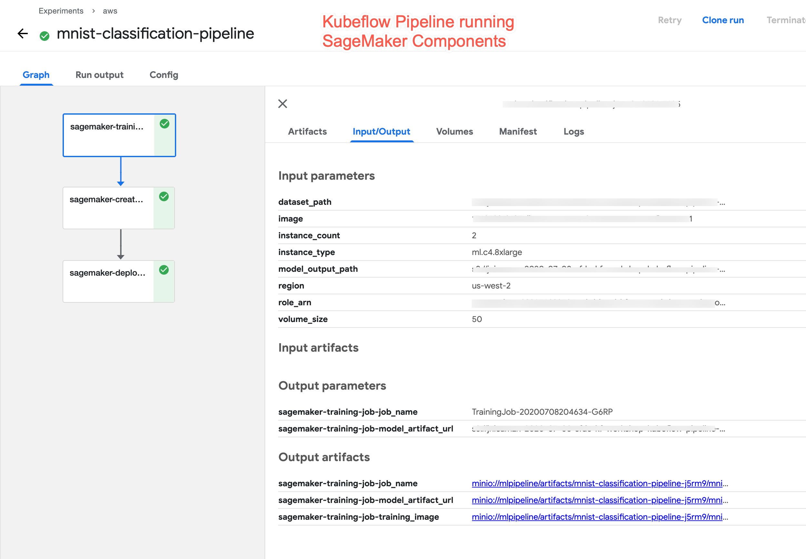
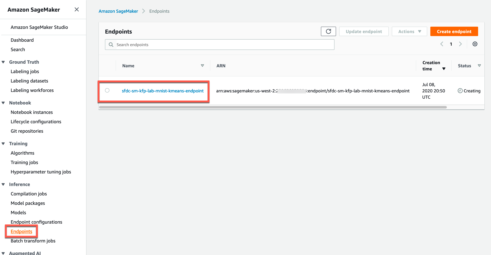

## Kubeflow Pipelines using SageMaker Components

Running Kubeflow Pipelines is a powerful end-to-end workflow. However, you still need to manage the Kubernetes resources (pods, nodes, clusters) for training and inference. 

A way to lower your overall TCO is to leverage the managed elements of SageMaker for training and inference.

In this lab, you will launch a Kubeflow Pipeline that invokes managed SageMaker components. You will:
- Create an AWS IAM User 
- Create an AWS IAM Policy
- Attach the AWS IAM Policy to the Kubeflow EKS Worker Node
- Create a Kubernetes Secret associated with the AWS IAM User
- Run through a Kubeflow Pipeline Notebook that invokes managed SageMaker components

### Visual Roadmap of Kubeflow Pipelines using SageMaker Components


### Setup AWS credentials for Kubeflow



**In the SageMaker Notebook Instance**, open the terminal using "New"/"Terminal" dropdown. (File-New-Terminal if Jupyter Lab)

- Switch to bash

```shell
bash
```

- Create an IAM user `kf-smuser`, attach S3 access policy and retrieve temporary credentials

```shell
aws iam create-user --user-name kf-smuser
aws iam attach-user-policy --user-name kf-smuser --policy-arn arn:aws:iam::aws:policy/AmazonSageMakerFullAccess
aws iam create-access-key --user-name kf-smuser > /tmp/create_output.json
```

- Save the new user’s credentials into environment variables:

```shell
export AWS_ACCESS_KEY_ID_VALUE=$(jq -j .AccessKey.AccessKeyId /tmp/create_output.json | base64)

export AWS_SECRET_ACCESS_KEY_VALUE=$(jq -j .AccessKey.SecretAccessKey /tmp/create_output.json | base64)
```

- Create the kubernetes secret in the kubeflow namespace:

```shell
cat <<EOF | kubectl apply -f -
apiVersion: v1
kind: Secret
metadata:
  name: aws-secret
  namespace: kubeflow
type: Opaque
data:
  AWS_ACCESS_KEY_ID: $AWS_ACCESS_KEY_ID_VALUE
  AWS_SECRET_ACCESS_KEY: $AWS_SECRET_ACCESS_KEY_VALUE
EOF

```

### Update the EKS Worker Role with S3 and SageMaker Access

**In a Terminal Session on the SageMaker Notebook Instance**

Attach the S3 and SageMaker access policy to the role, by follow these steps:

```shell
export AWS_CLUSTER_NAME="kf-sm-workshop"
export ROLE_NAME=`aws iam list-roles | jq -r ".Roles[] | select(.RoleName | startswith(\"eksctl-$AWS_CLUSTER_NAME\") and contains(\"NodeInstanceRole\")) .RoleName"`
```

- Add the S3 and SageMaker policy to the role

```shell
TRUST="{ \"Version\": \"2012-10-17\", \"Statement\": [ { \"Effect\": \"Allow\", \"Principal\": { \"Service\": [ \"sagemaker.amazonaws.com\",  \"ec2.amazonaws.com\"]}, \"Action\": \"sts:AssumeRole\" } ] }"

aws iam update-assume-role-policy --role-name $ROLE_NAME  --policy-document file://<(echo "$TRUST")

aws iam attach-role-policy --role-name $ROLE_NAME --policy-arn arn:aws:iam::aws:policy/AmazonSageMakerFullAccess

aws iam attach-role-policy --role-name $ROLE_NAME --policy-arn arn:aws:iam::aws:policy/AmazonS3FullAccess
```

### Assign sagemaker:InvokeEndpoint Permission to the Worker node IAM role

**In a Terminal Session on the SageMaker Notebook Instance**

#### Create the Policy Document

```shell
cat <<EoF > sagemaker-invoke.json
{
    "Version": "2012-10-17",
    "Statement": [
        {
            "Effect": "Allow",
            "Action": [
                "sagemaker:InvokeEndpoint"
            ],
            "Resource": "*"
        }
    ]
}
EoF
```

#### Apply the Policy

```shell
aws iam put-role-policy --role-name $ROLE_NAME --policy-name sagemaker-invoke-for-worker --policy-document file://sagemaker-invoke.json
```

#### Capture the Role ARN (used in the Kubeflow Pipeline SageMaker Notebook)
Run this command and capture the returned value. You will paste this into the next section.

```shell
aws iam list-roles     | jq -r ".Roles[] \
    | select(.RoleName \
    | startswith(\"eksctl-$AWS_CLUSTER_NAME\") and contains(\"NodeInstanceRole\")) \
    .Arn"
```

## Switch to KubeFlow Notebook and Run the SageMaker Pipeline Workbook


In the **Jupyter notebook interface of the Kubeflow notebook server** instance: 
- Open the `01_Kubeflow_Pipeline_SageMaker.ipynb` file under the `aws-ml-workshop/labs/sagemaker-kubeflow-pipeline` folder.
- Run through the notebook to create a Kubeflow Pipeline that invokes SageMaker Components

[Kubeflow Pipeline with SageMaker Components Notebook](../kubeflow/img/kubeflow-pipelines-sagemaker-components-notebook.png)


- This notebook walks you through an example for building a kubeflow pipeline and build and deploy an **MNIST** classification model using Amazon SageMaker. Step through the notebook cells to see SageMaker kubeflow pipeline components in action. **Remeber to pass in the SageMaker execution Role ARN to successfully run the job**.


## Visuals

### Stepping Through the Notebook

- As you step through the Notebook, you'll see this as the last step. 


- The "Run" Link will show something like this:



- Resources will appear in SageMaker:


Endpoint Config


Endpoint


